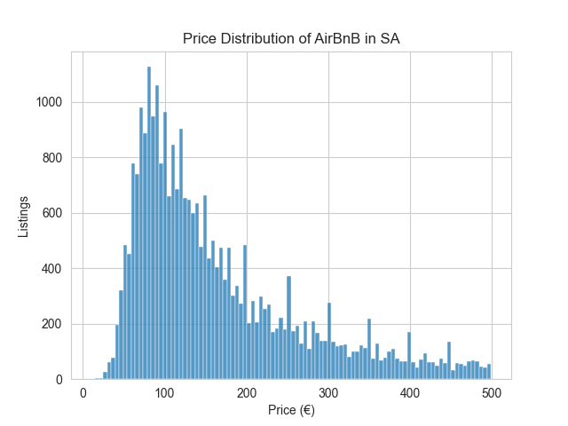

# Analysis of AirBnB listings in south Aegean.
This project explores Airbnb listings in the south Aegean sea, focusing in the distribution of the prices. 


## Dataset

The dataset (`listings.csv.gz`) contains detailed information about Airbnb listings in the South Aegean sea, including host details, location, property type, pricing, availability, and more.

## Objectives

- Load and inspect the dataset
- Clean the price data and handle missing values
- Visualize the price distribution
- Understand the pricing trends and common price points

## Key Observations
- The analysis focuses on listings priced under **€500**. 
- Most listings are clustered between **€50–€150**, with a peak around **€100**.
- After that, the number of listings slowly declines.
- There are visible **secondary clusters** or outliers at around **€200**, **€250**, **€300**, **€350**, and **€400** — likely because hosts prefer round numbers for their prices.


## Chart Example

The histogram below visualizes this price distribution:



## How to Run

1. Clone the repository
2. Install required libraries:
   ```bash
   pip install -r requirements.txt